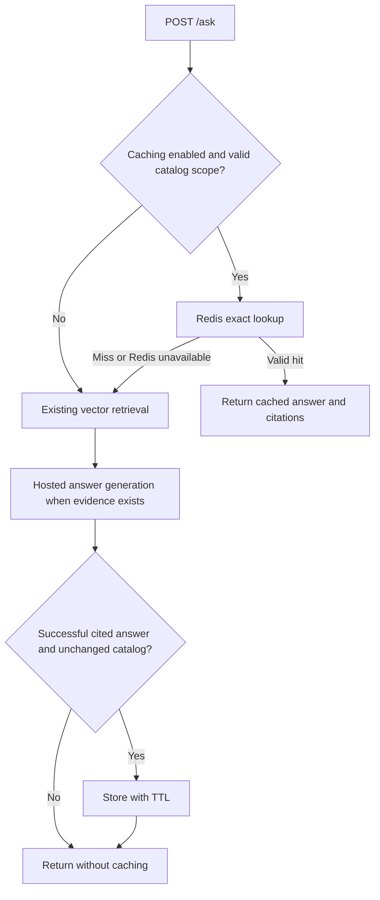

# Exact answer cache: first milestone

## Scope

Redis stores successful cited answers for exact repeated questions sent to `/ask`
with a managed `collection_id`. `/search` is unchanged. Default/CLI-only collections
without catalog records bypass the cache. This is ordinary Redis, not the managed
LangCache product. Public FAQ answers only; authenticated applications will need
authorization and identity scope before cache lookup.



## Local setup

Run from the repository directory in PowerShell:

```powershell
uv sync --extra dev --extra ui --extra cache
docker compose --profile cache up -d redis
docker compose exec -T redis redis-cli ping
$env:ANSWER_CACHE_MODE = "exact"
$env:REDIS_URL = "redis://127.0.0.1:6380/0"
.venv\Scripts\python.exe -m uvicorn main:app --host 127.0.0.1 --port 8769
```

Port 8769 allows an opt-in experiment without stopping the working APIs. Open
`http://127.0.0.1:8769/docs`. For the cloud-backed catalog, use
`scripts/run_cloud_api.py --port 8769` instead of the uvicorn command. Do not run
both on the same port. The existing Streamlit local/cloud URLs remain unchanged.
To enable on an existing API, stop and restart that API from the configured shell.
Settings are read at startup. Never launch a duplicate on an occupied port.

Submit an `/ask` request with a collection ID from that API's `/collections` list.
The first successful request returns `cache_hit: false` and
`answer_generation_called: true`. Send the identical request again: expect
`cache_hit: true`, `cache_type: "exact"`, `answer_generation_called: false`, the
same answer/citations, and a fresh request ID. The initial request uses normal
hosted-model credits. A hit does not call embeddings, Qdrant or the answer model.
Leading/trailing whitespace is ignored; case, punctuation and internal spaces
remain significant. Paraphrases still generate answers.

Set `ANSWER_CACHE_MODE=off` and restart to restore the uncached path. No data
migration is required. Redis failure falls back to RAG with bounded Redis timeouts
and no retries. The Redis port is loopback-only; this is not production security.

## Invalidation and limitations

- Keys isolate catalog path, vector target, collection/document scope, committed
  document inventory, embedding profile, context size, prompt and answer model.
- Application-managed uploads change the inventory and invalidate previous keys.
  Source changes during generation prevent writing that answer to cache.
- Direct Qdrant edits are not detected. Change `ANSWER_CACHE_NAMESPACE` or disable
  caching after out-of-band updates. Old keys expire automatically.
- Default TTL is 3600 seconds (`ANSWER_CACHE_TTL`). Redis is disposable, bounded
  to 128 MB with eviction and no disk persistence. Losing entries only causes misses.
- Abstentions, malformed entries and failed answers are not reused. Citation
  validation is not a factual accuracy guarantee: cached errors can repeat until
  invalidation. Review answer quality before semantic reuse.
- Concurrent initial misses can still generate duplicate answers. Single-flight
  locking, semantic similarity calibration and paraphrase validation are later work.
- Cache flags describe this request, not measured token savings. Cached source
  scores belong to the original identical request.

## Tests

```powershell
.venv\Scripts\python.exe -m pytest -q -p no:cacheprovider
$env:TEST_REDIS_URL = "redis://127.0.0.1:6380/0"
.venv\Scripts\python.exe -m pytest tests/test_answer_cache.py -q -p no:cacheprovider
Remove-Item Env:TEST_REDIS_URL
```

The opt-in Redis test uses the real Docker cache and FastAPI TestClient, with
simulated retrieval and generation counters. It proves a second request avoids
both operations, has a fresh request ID, and uses a TTL. It deletes only its unique
test key. It does not call HF or prove a live generated answer is factually correct.

Implementation: `src/faq_agent/cache/answers.py`, shared workflow in
`src/faq_agent/retrieval/retriever.py`, configuration in `src/faq_agent/config.py`.
