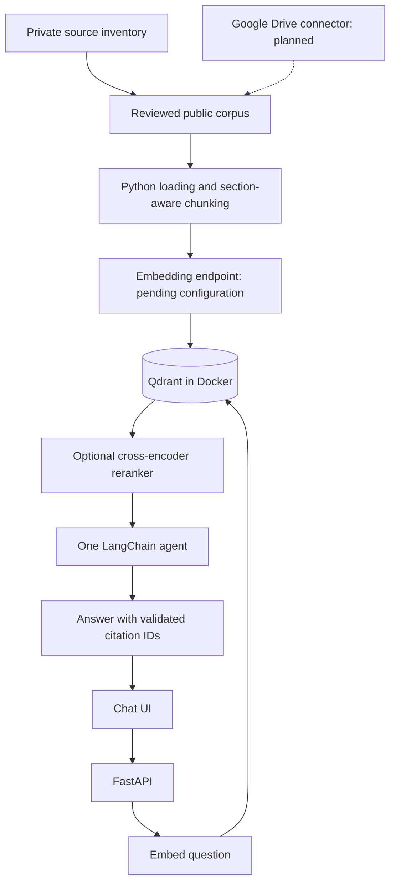

# Architecture

Ingestion is a separate command, not a chat request or API startup task.
Chunking creates pieces of text; embedding creates numeric vectors. Reranking compares
question/text pairs. It does not rewrite the stored embeddings.
The local dry run stops before embedding, so it needs neither HF credentials nor a database.

VectorStore is a small adapter boundary with Qdrant and Chroma implementations.
Index names fingerprint the embedding configuration. Retrieval filters by corpus version.
Import a complete new version, evaluate it, then change CORPUS_VERSION explicitly.
The agent performs initial retrieval and may use one bounded read-only retrieval tool.

Returned citations must reference retrieved chunks; this check does not establish that every
claim follows from its citation. Real document evaluation remains required.
Prompt instructions and source text are separate: documents are untrusted evidence.
Public sources must contain only information approved for public answers.

FastAPI currently runs locally. Dockerfile can also containerize it. Vercel is an optional
future API host; it cannot use this laptop's localhost database. Persistent database hosting
and ingestion workers must remain separate from ephemeral functions.
