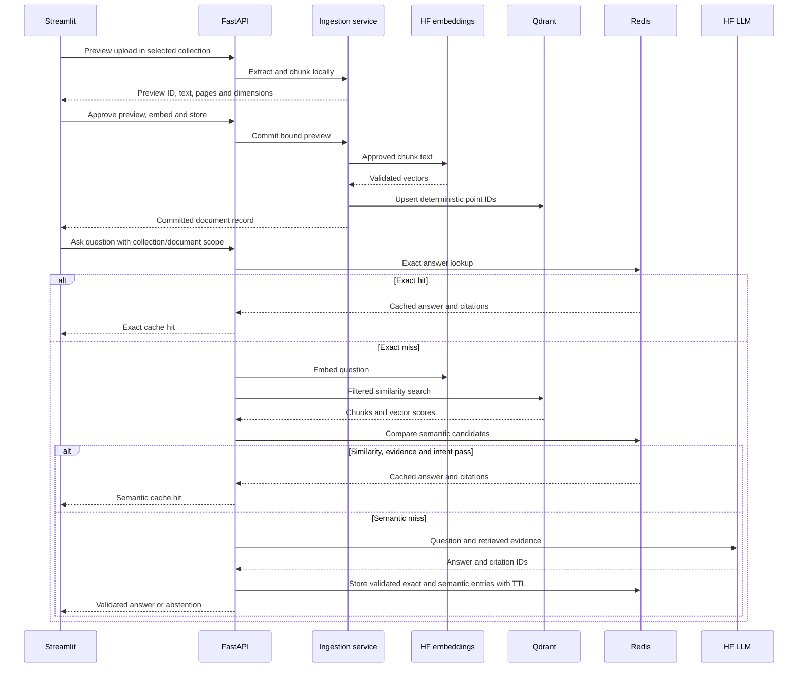

# Architecture

## Responsibilities

The package is `faq_agent`; responsibility folders live inside it to keep imports
unambiguous. HTTP routes validate requests and redact upstream failures. The shared
retrieval module selects either the UI collection or the configured CLI corpus.
The hosted LLM client generates answers and validates citation IDs against the
retrieved evidence. Prompts are separate from client transport code.

The ingestion service owns the upload lifecycle and SQLite catalog. The loader is
used by the versioned CLI workflow; UI PDF extraction is page-aware. Both use the
same chunker and embedding client. The vector-store adapters serve the CLI corpus;
the upload service uses Qdrant directly for its document-level lifecycle.

## Data and configuration

- Qdrant: vectors, chunk text, document/source IDs, filename, page and section.
- SQLite: managed collection identities, embedding profiles, committed document
  records and expiring previews. The path stays `.local/library.sqlite3` across
  this package refactor; no vector migration is required.
- Redis: optional exact and semantic answer entries. Semantic reuse is scoped by
  the catalog/document inventory, model and prompt fingerprints, then guarded by
  query similarity, current evidence overlap, role and negation intent. Redis is
  disposable and is not the source of truth.
- `.env`: private runtime settings. `.env.example`: supported keys and defaults.
  config.py validates settings. Existing retired keys in a private .env are ignored;
  setup_env.py --sync removes unsupported keys after creating a private backup.
- Embedding model, revision, dimensions, prefixes and chunk configuration determine
  the existing collection fingerprint. Changing this profile requires a new index.
  The LLM model can change without re-embedding documents.
- Default embedding model: BAAI/bge-small-en-v1.5, 384 dimensions. The hosted URL
  must actually serve that model. Current answer model selection is configurable;
  provider access and included credits must be checked separately.
- `.local/` also holds current server logs and ignored refactor backups. No new
  logs directory is added simply to duplicate existing runtime storage.

## Contracts

Both /search and /ask accept question, optional collection_id, and optional
document_id. Document scope requires collection scope. Ask calls the shared Python
retrieval function, not the /search HTTP route. Empty retrieval skips the LLM.

The UI only lists application-managed collections. Omitting collection_id selects
the versioned CLI corpus from configuration. The optional Chroma adapter remains
available for that CLI path (`uv sync --extra chroma`); upload management requires
Qdrant. Other vector stores are not implemented.

`ANSWER_CACHE_MODE` supports `off`, `exact` and `semantic`. Exact hits avoid
embedding, retrieval and generation. Semantic hits still embed and retrieve so the
current source evidence can be checked, but avoid answer generation. Redis failure
falls back to the uncached RAG path. Source, prompt or model changes create a new
cache scope rather than reusing stale answers.

Approval is required before embedding. Duplicate content is idempotent per
collection. Only committed documents are searchable; retrying an interrupted
commit reuses deterministic point IDs. The catalog must be backed up alongside
Qdrant. A collection is not a user-authorization boundary in this local MVP.

## Limitations and next steps

Chunking uses sections and overlapping character windows, not an embedding model.
Default sizes are 1000 characters with 150 overlap; PDF pages are processed
separately. Whole FAQ question/answer pairs are not guaranteed. The preview shows
planned dimensions, not a computed vector. See ui-testing.md for size limits.

Similarity scores are not confidence estimates. Citation validation checks that
IDs exist in the evidence; factual quality needs evaluation. There is no active
reranking, LangGraph, conversational memory, Drive/Box sync or monitoring stack.
Semantic cache decisions are exposed in `/ask` responses but are not yet persisted
as operational events.

Next: add cache decision monitoring and a durable promoted-answer store. Promotion
is planned after one generated answer plus two distinct qualifying paraphrase hits;
it is not implemented. Google Drive and Box will then use a common source-adapter
contract. Current SQLite/synchronous ingestion is not ready for ephemeral Vercel
instances. The API Dockerfile is packaging, not a validated production deployment.
