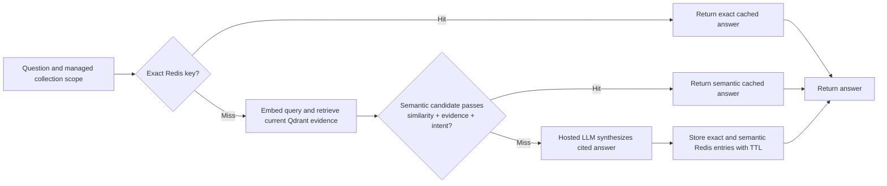
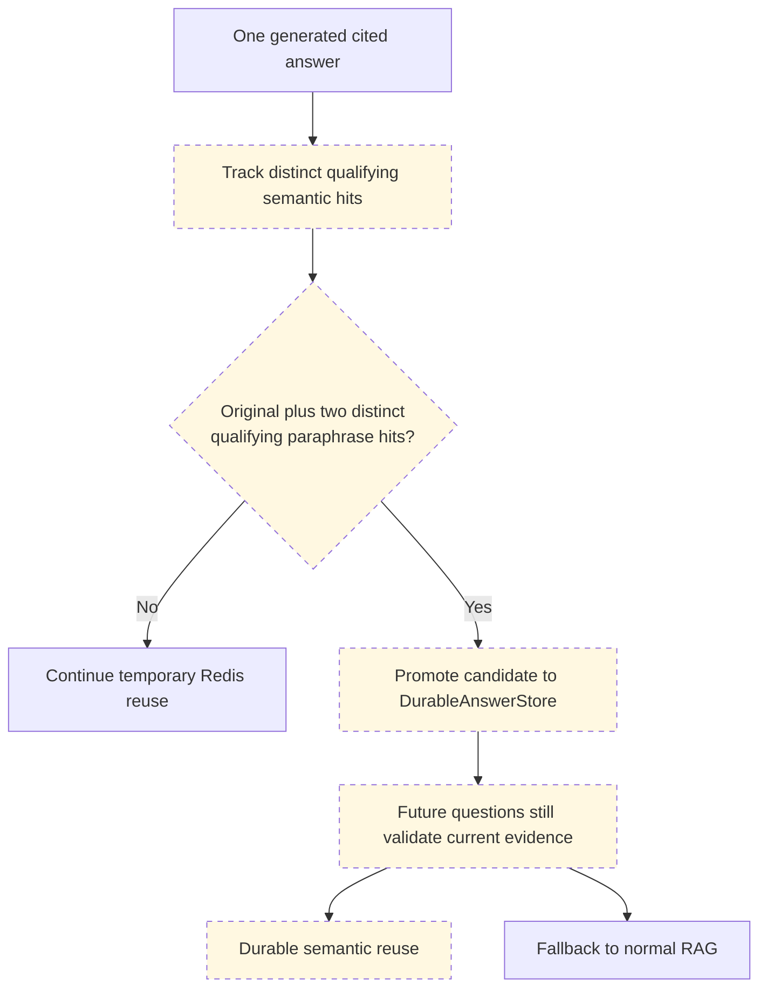

# Feature status and roadmap

This document is the current source for implemented capabilities and prioritized
work. Historical migration notes remain in their respective documents.

## Current capabilities

| Area | Status | Evidence |
| --- | --- | --- |
| Reviewed local upload and collection workflow | Implemented | Preview, approval, chunking, HF embedding and Qdrant storage |
| Scoped retrieval and grounded `/ask` answers | Implemented | `/search` returns vector scores; `/ask` validates citations |
| Local and Qdrant Cloud test isolation | Implemented | Separate API runtimes and SQLite catalogs |
| Exact Redis answer cache | Implemented | Repeat questions bypass embedding, retrieval and generation |
| Guarded semantic Redis reuse | Implemented | Similarity, current evidence overlap, role and negation controls |
| Durable answer promotion | Planned | No durable answer store or promotion counters yet |
| Cache decision monitoring | Planned | Response flags exist; durable events and metrics do not |
| Google Drive and Box source adapters | Planned | No external-source authentication or sync yet |
| Hosted API and UI deployment | Pending | Qdrant Cloud integration is verified; backend deployment is not |

## Implemented cache path

Semantic reuse is intentionally not a direct answer-text comparison. It validates
the current retrieval result before reusing a prior answer. Redis remains a
temporary optimization and can be safely cleared.

## Planned durable promotion tier

The promotion threshold will count distinct paraphrase fingerprints, not repeated
submissions of one exact question. The durable record must include collection and
document scope, source IDs, content/model/prompt fingerprints, accepted paraphrase
metadata, status, timestamps and a review/retirement path. The first adapter is
planned for a dedicated Qdrant answer-memory collection; a future pgvector adapter
must satisfy the same interface.

## Next issues

1. Persist cache decision events: `exact_hit`, `semantic_hit`, `miss`, `bypass`,
   `rejected_candidate`, `store_error`, with request ID, safe scope identifiers,
   latency, similarity and evidence-overlap values. Do not log full questions or
   answer text by default.

2. Implement the durable-answer store and promotion rule. Test Redis restart,
   source/model invalidation, candidate retirement and no duplicate promotion.

3. Create a reviewed FAQ evaluation set. Score answer correctness, source support,
   unsupported claims, privacy/role boundaries, multi-section synthesis and
   refusal behavior.

4. Define the external document-source adapter contract, then implement a manual
   Google Drive import. Box follows through the same contract. Update and deletion
   synchronization are separate work.

5. Choose durable deployment metadata storage, authentication, background jobs,
   rate limiting and a hosted Redis configuration before deploying the API.

## Commit history

The current local baseline includes these focused commits:

| Commit | Purpose |
| --- | --- |
| `585dbda` | Preserve collection validation errors as HTTP 422 |
| `57b3aea` | Isolate cloud catalogs and runtime settings |
| `3e1a094` | Switch the Streamlit workspace between local and cloud |
| `a80619b` | Add optional Redis exact-answer caching |
| `637330f` | Document cloud migration and answer-cache verification |

Guarded semantic caching and this documentation refresh are working-tree changes
pending their own focused commits.
